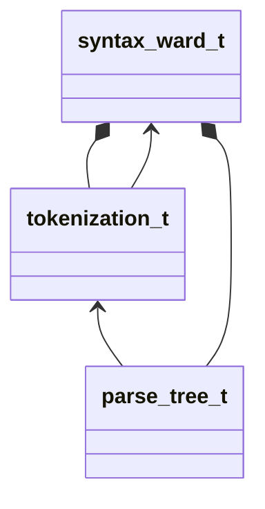

# Syntax Module

## Topological Order of Dependency Graph

* [syntax_ward.hpp](syntax_ward.hpp)
* [tokenization.hpp](tokenization.hpp)
* [parse_tree.hpp](parse_tree.hpp)
* [parse_tree_nursery.hpp](parse_tree_nursery.hpp)
* [parse_axe.hpp](parse_axe.hpp)
* [seed.hpp](seed.hpp)
* [seed_engine.hpp](seed_engine.hpp)

