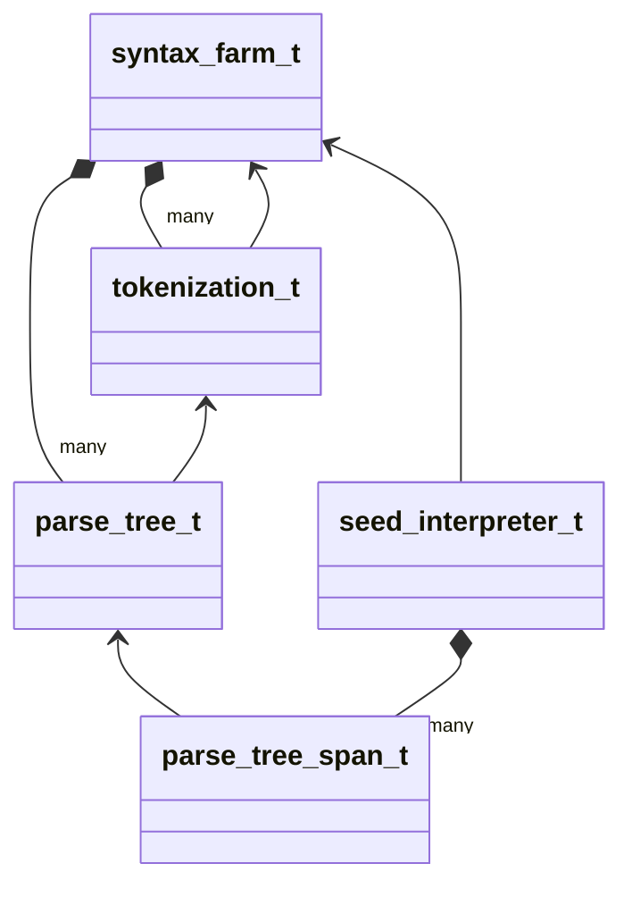

# Syntax Module

## Topological Order of Dependency Graph of Header Files

* [syntax_farm.hpp](syntax_farm.hpp)
* [fragmentization_data.hpp](fragmentization_data.hpp) (generated)
* [fragmentization.hpp](fragmentization.hpp)
* [tokenization.hpp](tokenization.hpp)
* [parse_tree.hpp](parse_tree.hpp)
* [parse_tree_nursery.hpp](parse_tree_nursery.hpp)
* [name_id_style.hpp](name_id_style.hpp)
* [seed_tokenizer.hpp](seed_tokenizer.hpp)
* [seed_axe.hpp](seed_axe.hpp)
* [seed.hpp](seed.hpp)
* [seed_interpreter.hpp](seed_interpreter.hpp)
* [fern.hpp](fern.hpp)
* [syntax.hpp](syntax.hpp)

```mermaid
classDiagram
    syntax_farm_t *-- "many" tokenization_t
    syntax_farm_t *-- "many" parse_tree_t
    syntax_farm_t <-- tokenization_t
    tokenization_t <-- parse_tree_t
    parse_tree_t <-- parse_tree_span_t
    seed_interpreter_t *-- "many" parse_tree_span_t
    syntax_farm_t <-- seed_interpreter_t
```
