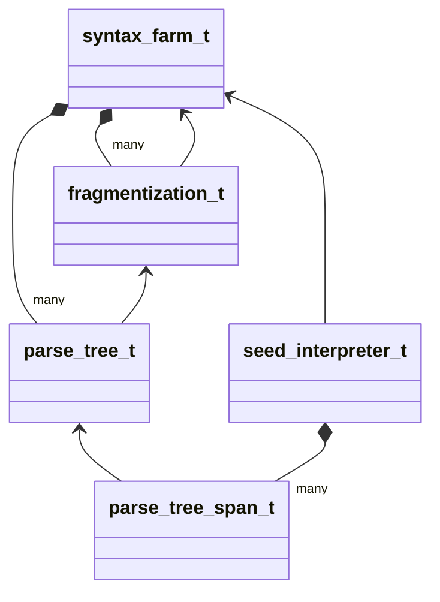

# Syntax Module

## Fragmentization

Fragmentization is the first step that is applied to every input file of Silva. Fragmentization is a
bit like tokenization/lexing in other languages, although more fine-grained: fragments in Silva are
usually smaller than tokens in other languages.

All input files are assumed to be encoded in UTF-8. For the most part, all that fragmentization does
is break the input up into Unicode codepoints. Fragmentization also does a few additional things,
though:
* Recognize indentation and sub-languages.
* Recognize multiline strings.
* Recognize line continuations.
* Categorize codepoints.

The output/result of fragmentization is an array of "fragments". Every fragment has a category, cf.
the enum [silva::fragment_category_t](fragmentization.hpp)". The `silva_fragmentization` tool can be
used on a file to see what fragments Silva produces for this file.

```
build/bin/silva_fragmentization silva/syntax/00-fragmentization.demo
```

Sub-languages 

By 'XID_Start' and 'XID_Continue' here we mean the Unicode derived core properties with the same
name.

* [whitespace] Only space and newlines are allowed; no tabs; no carriage-return. Some of those are
then interpreted under the "indent" and "newline" rubriks below, others are "genuine whitespace".
* Fragmentation does *not* know about comments or single-line string-literals; those are the
concern of the individual languages and are described in Seed (see "Comments and strings" below).
Only Zig-style multi-line string literals (introduced by '¶') are recognised here, as a single
MULTILINE_STRING fragment, because they span several lines and would otherwise interfere with the
off-side rule.
* A '\\' at the end of a line is a line continuation (LINE_CONTINUATION).
* [identifier] XID_Start XID_Continue*.
* [number] everything that starts with [0-9] followed by XID_Continue.
* [operator,parenthesis] Every unicode code-point that has the derived core property Math but is not
also in XID_Continue. A distinction is made between operators representing opening or closing
parentheses (called parentheses-chars, as per [this
answer](https://stackoverflow.com/a/13535289/1171688)) and all other operator chars. The parentheses
chars are not required to be properly nested at this stage.
* [indent,dedent,newline] Only space and newline are allowed. Indenting works like Python, except
that INDENT and DEDENT are generated regardless of any enclosing parentheses (like in Haskell and
F#); use a trailing '\\' to continue a line. Note that here the equivalent of Python's INDENT and
DEDENT are still fragments rather than tokens. Also, at this stage there is only a single NEWLINE
fragment (not NL and NEWLINE like in Python); every line-end produces one, including the line-ends
of blank lines (fragmentation cannot tell which lines are blank, as it does not know about
comments). A line whose indentation matches none of the enclosing indentation levels produces an
INDENTATION_BROKEN fragment.
* Any other Unicode code-point not explicitly allowed by any of the semantic fragments or any
sequence that's not in NFC in the semantic part means that the input file is ill-formed.

## The Seed Language

## Topological Order of Dependency Graph of Header Files

* [syntax_farm.hpp](syntax_farm.hpp)
* [fragmentization_data.hpp](fragmentization_data.hpp) (generated)
* [fragmentization.hpp](fragmentization.hpp)
* [parse_tree.hpp](parse_tree.hpp)
* [parse_tree_nursery.hpp](parse_tree_nursery.hpp)
* [seed.lexicon.hpp](seed.lexicon.hpp)
* [seed_axe.hpp](seed_axe.hpp)
* [seed.hpp](seed.hpp)
* [seed_interpreter.hpp](seed_interpreter.hpp)
* [syntax.hpp](syntax.hpp)


```mermaid
classDiagram
    syntax_farm_t *-- "many" fragmentization_t
    syntax_farm_t *-- "many" parse_tree_t
    syntax_farm_t <-- fragmentization_t
    fragmentization_t <-- parse_tree_t
    parse_tree_t <-- parse_tree_span_t
    seed_interpreter_t *-- "many" parse_tree_span_t
    syntax_farm_t <-- seed_interpreter_t
```
