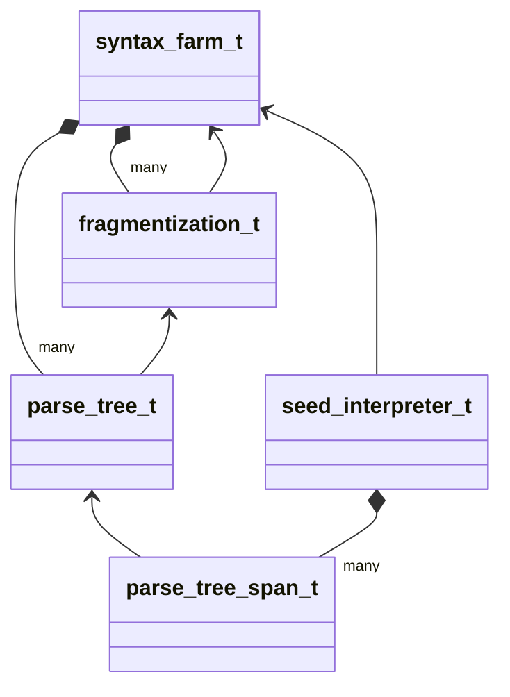

# Syntax Module

## Fragmentization

Fragmentization is the first step that is applied to every input file of Silva. Fragmentization is a
bit like tokenization/lexing in other languages, although more fine-grained: fragments in Silva are
almost always shorter than tokens in other languages or equally long.

[fragmentization.hpp](fragmentization.hpp)

All input files are assumed to be encoded in UTF-8. For the most part, all that fragmentization does
is break the input up into Unicode codepoints. Fragmentization also does a few additional things,
though:
* Recognize indentation and sub-languages.
* Recognize multiline strings.
* Recognize line continuations.
* Categorize Unicode codepoints.

The output/result of fragmentization is an array of "fragments". Every fragment has a category based
on the enum `fragment_category_t`. The `silva_fragmentization` tool can be used on a file to see
what fragments Silva produces for this file.

```
build/src/silva_fragmentization src/syntax/readme.fragmentization.demo
```

Sub-languages can be introduced in two ways. The first way is by using the parenthesis characters
'«' '»'. These two characters have a strong, special meaning in Silva; they even retain their
meaning in most strings and comments. It's also possible to introduce a sub-language via the
character '⎢'. With this approach everything on the same line to the right is considered to be a
sub-language and consecutive lines which also have this character are considered to also belong to
that sub-language. This is a bit similar to multiline string literals in Zig. In Silva, such
multiline literals are also supported, but via the character '¶'.

Indentation is handled similarly to Python, with INDENT and DEDENT fragments being emitted whenever
the indentation level increases or decreases. In order to also support free-form languages (like C),
though, there exists an additional INDENTATION_BROKEN fragment, which is emitted if a lower
indentation level was encountered that was not previously encountered.

Also a NEWLINE fragment is emitted at the end of every line that does not use line continuation ('\'
character at the end). Unlike in Python, NEWLINE fragments are not omitted inside parentheses.

All other fragments correspond one-to-one to Unicode codepoints. Such fragments are called "simple",
and they have one of the following categories:
* SPACE: ASCII 0x20 ' '
* DIGIT: '0' to '9'
* PARENTHESIS: operator that has a matching open/close operator, e.g., '{' '}'
* OPERATOR: e.g., '*'
* ID_LOWER: Unicode Derived Property = LetterLowercase
* ID_UPPER: Unicode Derived Property = LetterUppercase
* ID_START: Unicode Derived Property: XID_Start (including ID_LOWER, ID_UPPER)
* ID_CONTINUE: Unicode Derived Property: XID_Continue (including ID_START)

Any other Unicode code-point not explicitly allowed as above, or any sequence that's not in NFC,
means that the input file is considered to be ill-formed.

One of the core ideas behind the design of the fragmentization is that a language should be able to
determine the name of a used sub-language from its own type system, without that name being
explicitly mentioned in the text. For this it was necessary to make all languages share the same
fragmentization. The fragmentization is the common denominator between all languages in Silva.

## Tokens and Names

Tokens and names are both represented by integers in Silva via the value-types `token_id_t` and
`name_id_t`. The struct `syntax_farm_t` maintains the mapping from those integers to the strings
represented by those tokens/names.

[syntax_farm.hpp](syntax_farm.hpp)

A "token" can be thought of as an interned string. The syntax-farm contains an array of `token_info_t`
values, and the integer stored in the `token_id_t` refers to an entry in that array.

A "name" is effectively a sequence of tokens. To represent a name as a single integer, the
syntax-ferm contains an array of `name_info_t` values, which stores a single token and the parent
name (singly-linked list).

## The Seed Language

The Seed language provides a way to succinctly define parsing functions. A parsing function is a
function that turns a fragmentization into a parse-tree. A parse-tree here is very specific
data-type, which is described by the types `parse_tree_t` or more commonly `parse_tree_span_t`.

[parse_tree.hpp](parse_tree.hpp)

In short, a parse-tree is an contiguous array or span of nodes that is sorted in pre-order. Each
node stores the tree structure via two integers (`num_children` and `subtree_size`). Futhermore,
each node stores some semantic information (a rule-name, the fragment-range that it corresponds to,
and whether this node is understood to represent a token; see below).


The Seed language allows to quickly define recursive descent parsers (plus shunting-yard). Where
this not enough, parser should be amendable with aribtrary user code.

skipping

* `ANY` matches one *visible* fragment, i.e. anything except INDENT, DEDENT, INDENTATION_BROKEN,
NEWLINE and LINE_CONTINUATION. Rules built out of `ANY` are therefore automatically confined to a
single line.
* `LANGUAGE` matches a whole balanced LANG_BEGIN/LANG_END region; putting it before `ANY` in an
alternation is what allows a comment to contain « … ».

The standard definitions live in `seed::globals_str`: `string`, `indent`, `dedent`, `newline` and
the two skip-rules `offSide` and `freeForm`. A language selects one of the latter via its `skip`
rule.

* The code-points that fragmentation still treats specially -- '⎢', '«', '»', '¶' and a '\\' at the
end of a line -- keep their meaning inside comments and strings. In particular a '«' inside a
comment must still be matched by a '»'.
* Comments are code as far as the off-side rule is concerned: they take part in indentation and a
mis-indented comment leads to a INDENTATION_BROKEN fragment.
* The parse-tree data-structure is built directly into Silva. One can define literals that are
parse-trees. Silva variables can holds parse-trees. Silva functions can take and return parse-trees.


## Topological Order of Dependency Graph of Header Files

* [syntax_farm.hpp](syntax_farm.hpp)
* [fragmentization_data.hpp](fragmentization_data.hpp) (generated)
* [fragmentization.hpp](fragmentization.hpp)
* [parse_tree.hpp](parse_tree.hpp)
* [parse_tree_nursery.hpp](parse_tree_nursery.hpp)
* [seed.lexicon.hpp](seed.lexicon.hpp)
* [seed_axe.hpp](seed_axe.hpp)
* [seed.hpp](seed.hpp)
* [seed_interpreter.hpp](seed_interpreter.hpp)
* [syntax.hpp](syntax.hpp)


